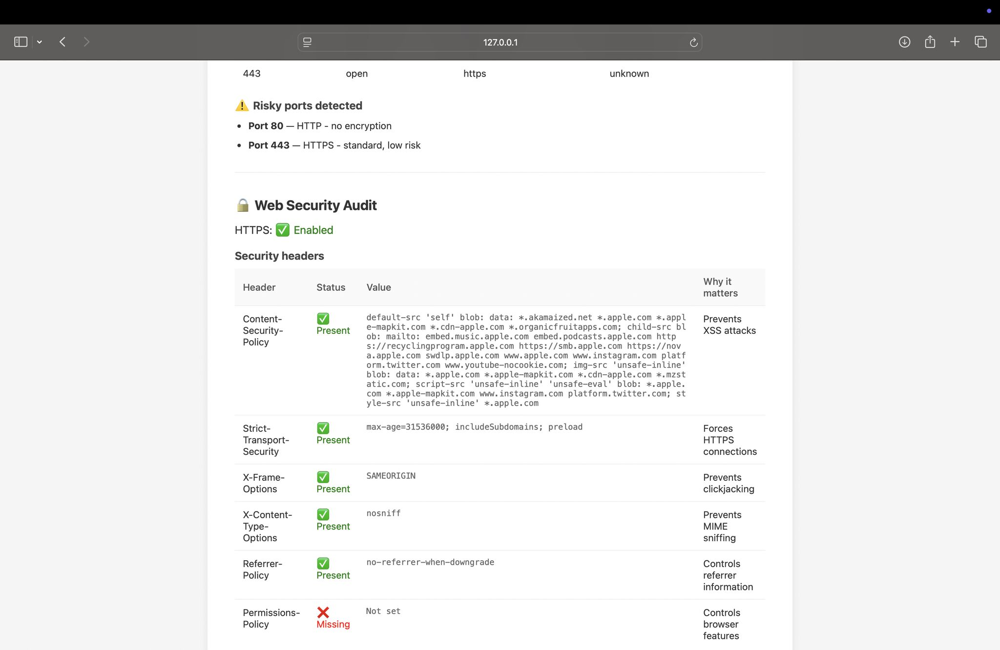
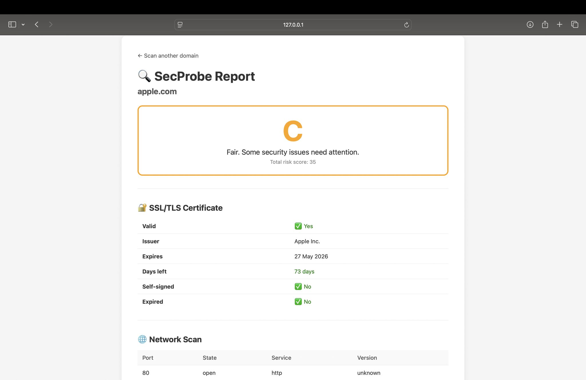

# SecProbe

SecProbe is a cybersecurity and network auditing tool focused on vulnerability analysis and system awareness.

## Features
- Network and port scanning
- Vulnerability analysis
- Security diagnostics
- Basic system auditing tools

## Tech Stack
- Python
- Networking Libraries
- Security Tools

## Goal
The project focuses on exploring cybersecurity concepts through practical implementation and understanding how security analysis tools work in real-world environments.

## Status
Currently under development.

## Screenshots

### Port Scanning

### Scan Results

### Risk Score Analysis

## Future Improvements
- Advanced vulnerability detection
- Real-time monitoring
- Automated security reports
- Expanded network analysis capabilities

## Developer
Ayushi Tripathi
